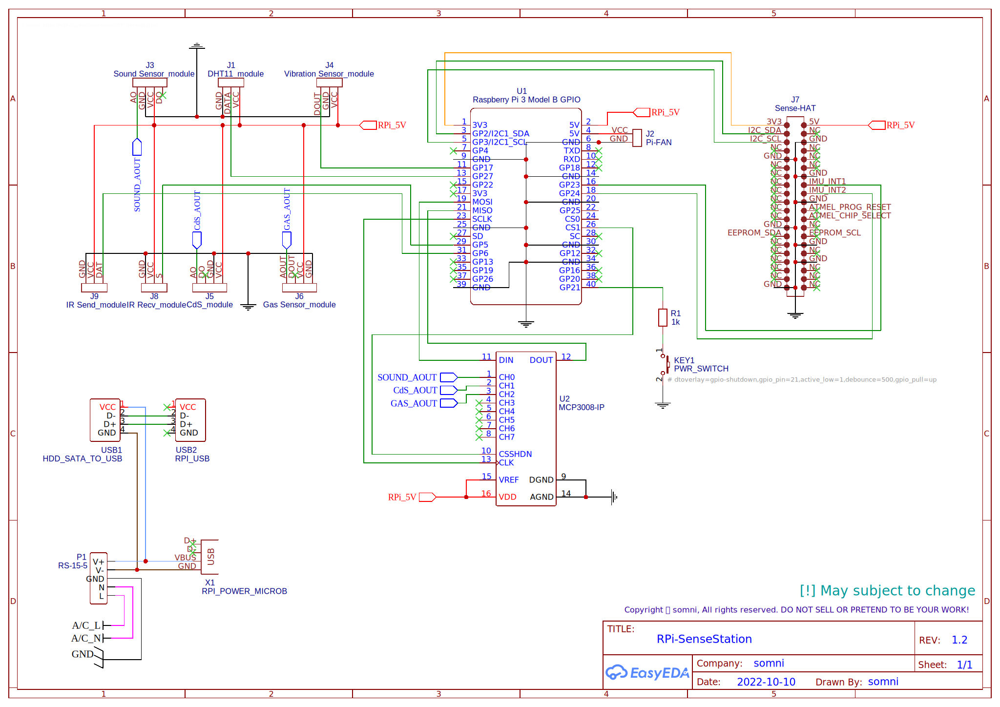

RPi-SenseStation Electric Circuit
=================================
This directory contains electric circuit schematic sheet, which was made/designed by me to help understand how to wire between these *small pieces of devils*.

You can open [the schematic file](Schematic.json) using [EasyEDA](https://easyeda.com/). Note that this schematic **is not** made for printing PCB, as many of parts missing their PCB footprints and many parameters may not optimized for it.

## Schematic preview

## Pinouts
 - Mean Well RS-15-5 A/C to D/C power supply
   | from         | to                                                                 |
   | ------------ | ------------------------------------------------------------------ |
   | A/C L        | L from A/C wall power cord                                         |
   | A/C N        | N from A/C wall power cord                                         |
   | GND          | Ground from A/C wall power cord, *not necessary but recommended*   |
   | D/C V+       | V+ from USB type micro-B cable + VCC from HDD SATA to USB cable    |
   | D/C V-       | V- from USB type micro-B cable + GND from HDD SATA to USB cable    |
   |              | *Data wires(D+, D-) from USB type micro-B cable are not connected* |
   |              | *Power wires(VCC, GND) from RPi USB are not connected*             |
 - MCP3008 ADC converter
   | from         | to                  |
   | ------------ | ------------------- |
   | VDD (#16)    | RPi 5V              |
   | VREF (#15)   | RPi 5V              |
   | DGND (#9)    | RPi GND             |
   | AGND (#14)   | RPi GND             |
   | DIN (#11)    | RPi MOSI (#19)      |
   | DOUT (#12)   | RPi MISO (#21)      |
   | CSSHDN (#10) | RPi CS1 (#26)       |
   | CLK (#13)    | RPi SCLK (#23)      |
   | CH0 (#1)     | Sound sensor AO     |
   | CH1 (#2)     | CdS light sensor AO |
   | CH2 (#3)     | Gas sensor AOUT     |
 - HDD SATA to USB converter *(cable modded)*
   | from | to                       |
   | ---- | ------------------------ |
   | VCC  | PSU D/C V+               |
   | GND  | PSU D/C V-               |
   | D+   | Raspberry Pi USB port D+ |
   | D-   | Raspberry Pi USB port D- |
 - Pi-FAN
   | from | to           |
   | ---- | ------------ |
   | VCC  | RPi 5V (#4)  |
   | GND  | RPi GND (#6) |
 - Sense HAT
   | from                      | to                          |
   | ------------------------- | --------------------------- |
   | 3V3 (#1)                  | RPi 3V3 (#1)                |
   | 5V (#2)                   | RPi 5V (#2)                 |
   | GND                       | RPi GND                     |
   | I2C SDA (#3)   | RPi I2C SDA (#3) |
   | I2C SCL (#5)   | RPi I2C SDA (#5) |
   | IMU Interrupt 1 (#16)     | RPi GPIO23 (#16)            |
   | IMU Interrupt 2 (#18)     | RPi GPIO24 (#18)            |
   | *... other pinouts*       | *not connected*             |
 - Power switch
   | from   | to                                                 |
   | ------ | -------------------------------------------------- |
   | Common | Guard resistor between switch and RPi GPIO21 (#40) |
   | NO     | RPi GND                                            |
   | *NC*   | *not connected*                                    |
 - DHT11 module
   | from   | to               |
   | ------ | ---------------- |
   | VCC    | RPi 5V           |
   | GND    | RPi GND          |
   | DATA   | RPi GPIO27 (#13) |
 - Vibration sensor module
   | from   | to               |
   | ------ | ---------------- |
   | VCC    | RPi 5V           |
   | GND    | RPi GND          |
   | DOUT   | RPi GPIO17 (#11) |
 - IR receive module
   | from   | to              |
   | ------ | --------------- |
   | VCC    | RPi 5V          |
   | GND    | RPi GND         |
   | S      | RPi GPIO5 (#29) |
 - IR send module
   | from   | to              |
   | ------ | --------------- |
   | VCC    | RPi 5V          |
   | GND    | RPi GND         |
   | DAT    | RPi GPIO6 (#31) |
 - Sound pressure sensor module
   | from   | to               |
   | ------ | ---------------- |
   | VCC    | RPi 5V           |
   | GND    | RPi GND          |
   | AO     | MCP3008 CH0 (#1) |
   | *DO*   | *not connected*  |
 - CdS light sensor module
   | from   | to               |
   | ------ | ---------------- |
   | VCC    | RPi 5V           |
   | GND    | RPi GND          |
   | AO     | MCP3008 CH1 (#2) |
   | *DO*   | *not connected*  |
 - Gas sensor module
   | from   | to               |
   | ------ | ---------------- |
   | VCC    | RPi 5V           |
   | GND    | RPi GND          |
   | AOUT   | MCP3008 CH2 (#3) |
   | *DOUT* | *not connected*  |
